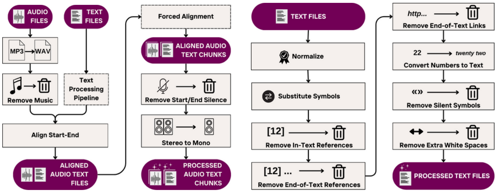

# ManaTTS-Persian-Speech-Dataset

ManaTTS is the largest publicly accessible single-speaker Persian corpus, comprising approximately 86 hours of audio with a sampling rate of 44.1 kHz. It is released under the open CC-0 license, enabling educational and commercial use. This dataset is a comprehensive speech dataset for the Persian language, collected from the [Nasl-e-Mana](https://naslemana.com/) magazine. It includes a wide range of topics and domains, making it suitable for training high-quality text-to-speech models. The dataset is accompanied by a fully transparent, open-source pipeline for data collection and processing, including tools for audio segmentation and forced alignment.

## Dataset
The ManaTTS dataset can be downloaded from [this link](https://huggingface.co/datasets/AnonymousManaTTS/AnonymousManaTTS). You can access a smaller, random sample of this dataset in the [sampled data directory](sample_data). These samples were selected to reflect the same distribution of match qualities as the complete dataset. For more details on match qualities, please refer to the paper (link to be updated).

## Raw Data Crawling
The raw data for this dataset was crawled from the Nasl-e-Mana magazine website. The crawling script used for this purpose is also provided in this repository and on Google Colab in [this link](https://colab.research.google.com/drive/1_E5KYAwuCr9B8k6EPYjVErsx-7rrr8Vl?usp=sharing).

## Processing Pipeline
The following figure illustrates the overall processing pipeline used to create the ManaTTS dataset, including the steps for preproces

This pipeline is available as a Jupyter Notebook included in this repository.  You can also run the notebook on Google Colab using [this link](https://colab.research.google.com/drive/1fWTy4IH2tSuOLrLSD8E8LMaUlI_Gnf-e?usp=sharing).

To run the pipeline, follow these steps:

1. Set up the required environment (details in the notebook)
2. Place the raw audio and text files in a directory named `raw`
3. Execute the cells in the notebook sequentially

## Trained TTS Model
A text-to-speech (TTS) model has been trained on the ManaTTS dataset. The code for training the model, as well as some output samples, are available in [this repository](https://anonymous.4open.science/r/Persian-MultiSpeaker-Tacotron2-2412).

## Contributing
Contributions to this project are welcome! If you encounter any issues or have suggestions for improvements, please open an issue or submit a pull request.

## License
The ManaTTS dataset is released under the CC-0 1.0 license, while the processing pipeline is licensed under the MIT license.

## Important Notice on Ethical Use of ManaTTS Dataset

The ManaTTS dataset is provided exclusively for research and development purposes. We emphasize the critical importance of ethical conduct in utilizing this dataset. Please refrain from any misuse, including but not limited to voice impersonation, identity theft, or fraudulent activities. 

By accessing and using the ManaTTS dataset, you are obligated to uphold the highest standards of integrity and respect for user privacy. Any violation of these principles may have severe legal and ethical consequences.

For any inquiries or clarifications regarding the use of this dataset, please reach out to us at [contact info to be updated]. Your cooperation in ensuring responsible use of this dataset is greatly appreciated.

## Acknowledgment

We would like to express our sincere gratitude to [Nasl-e-Mana](https://naslemana.com/), the monthly magazine of the blind community of Iran, for their generosity. Their commitment to openness and collaboration has been instrumental in advancing research and development in speech synthesis. We are especially thankful for their choice to release the data under the Creative Commons CC-0 license, allowing for unrestricted use and distribution.

